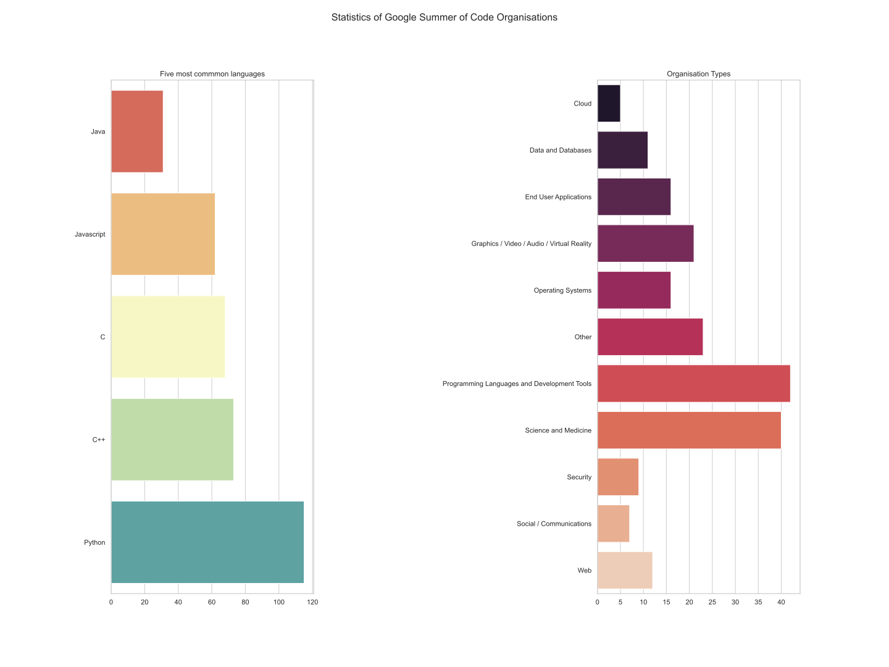

# Google Summer of Code Analytics

## Choosing your organisation
We talked about the need to connect to partner organisations in order for us to participate. But well what are some parameters you might consider before choosing an organisation? This is the most commonly asked question after the questions regarding opensource itself.
My analysis aims to bring you better ways to choose your organisation. Although GSoC website provides you with plenty of information regarding an organisation allowing you to filter them according to categories of concentration, single programming language or topic choices. I found it still lacking some crucial parameters regarding how one might go about choosing an organization.
First I would start with my observations using the data I scraped. Then I will show you how you can go about scraping and analyzing the organisation data by yourself.

## Most common languages and organisation types
Knowing this may be extremely essential for those new to programming. Looking at these extremely advanced projects, you want to concentrate while keeping your choices diverse.

