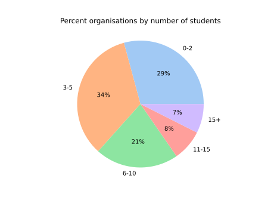

# Google Summer of Code Analytics

## Choosing your organisation
We talked about the need to connect to partner organisations in order for us to participate. But well what are some parameters you might consider before choosing an organisation? This is the most commonly asked question after the questions regarding opensource itself.
My analysis aims to bring you better ways to choose your organisation. Although GSoC website provides you with plenty of information regarding an organisation allowing you to filter them according to categories of concentration, single programming language or topic choices. I found it still lacking some crucial parameters regarding how one might go about choosing an organization.
First I would start with my observations using the data I scraped. Then I will show you how you can go about scraping and analyzing the organisation data by yourself.

## Most common languages and organisation types
Knowing this may be extremely essential for those new to programming. Looking at these extremely advanced projects, you want to concentrate while keeping your choices diverse.


We can see that the most common languages in GSoC are:
- Python
- C++
- C
- JavaScript
- Java

C++ and C being on the list is not surprising considering the fact that most projects on GSoC involve some sort of development.
Similarly most common organisational types are:
- Programming Languages and Developmental tools
- Science and Medicine
- Virtual Reality and media
- End User applications

among others…
This provides us a clear idea about what GSoC organisations might be looking for in general.

## Number of students in an organisation
Understanding this is also crucial given that I keep getting the advice that first time GSoCers are much more welcome into larger organisations rather than smaller ones. It makes sense because these organisations have often been participating in GSoC since its inception and know how things go around.



We see that only 7% of all the 200+ organisations accept more than 15 students.
### Large organisations
Though my intention is not to discourage you from attending smaller organisations, in fact if you really have a niche interest and know what you want to do then you might as well go for a smaller organisation. But it would be incomplete if I do not mention the "large" organisations.
Here are the organisations with 15+ participants in no particular order straight form my terminal:

```
CERN-HSF
Oppia Foundation
KDE Community
The Honeynet Project
INCF
The R Project for Statistical Computing
Rocket.Chat
GNOME Foundation
Free and Open Source Silicon Foundation
OSGeo - Open Source Geospatial Foundation
Zulip
Red Hen Lab
Digital Impact Alliance (DIAL) at UN Foundation
Processing Foundation
OWASP Foundation
International Catrobat Association
SCoRe Lab
OpenCV
The Apache Software Foundation
NumFOCUS
The LLVM Compiler Infrastructure
TensorFlow
The Linux Foundation
Liquid Galaxy project
CNCF
Python Software Foundation
National Resource for Network Biology (NRNB)
OpenMRS
Machine Learning for Science (ML4SCI) Umbrella Organization
The Julia Language
AOSSIE
```

Not surprising that the list contains many famous influential projects.

## Technology
I used Python 3 with libraries of Selenium and BeautifulSoup4. My project does not use click feature instead it grabs the Organization ID form the internal html.


Then we notice that URLs for the organization sub pages can be derived from the organization's ID. First saving this list of Organisation IDs into a variable and then using it to iterate over rest of the URLs, saves us computational time and makes our code efficient.

## Tinkering
This is code and you can tinker with it in any way you like. I have saved quite a few .dat files for you to play around. 
### Playing around with existing data
If you would like to filter your organisation according to interests (which was clearly out of scope for this article). You can do so with the data_read file in the code section. I have laid a couple of examples with which you could possibly play around.
Steps you need to follow
1. Clone the entire repository
2. Change the time delta i.e. ```days = ```number of day difference with the folder of .dat files in our case, in our case ```code\orgs-2021–10–05```
```
direct = f"./code/orgs-{date.today() - timedelta(days = 7)}/"  
```
### Data structure
Each .dat file stores a dictionary. The dictionary keys are:
```
'name', 'tech', 'org_type', 'org_topics', 'num_students', 'students'
```
The objects stored in these keys are of types:
```
<class 'str'>, <class 'list'>, <class 'str'>, <class 'list'>, <class 'int'>, <class 'list'>
```
Additionally the last list contains a list of lists with student name, project, URL in the same order. So you can directly view projects that sound interesting directly from your IDE.
### Data for years other than 2021
The way the GSoC website is presented will most probably remain same and has remained same for a couple of years. This very good news because you can probably do similar analysis for other years.
You just need to make a minor change in this file i.e. ```/code/main.py``` changing the url parameter to:
```
https://summerofcode.withgoogle.com/archive/2020/organizations/
or to one of the following:
https://summerofcode.withgoogle.com/archive/2019/organizations/
https://summerofcode.withgoogle.com/archive/2018/organizations/
https://summerofcode.withgoogle.com/archive/2017/organizations/
https://summerofcode.withgoogle.com/archive/2016/organizations/
```
Pretty cool eh!

You can now do multi-analysis and yeah that is an overkill for anyone to choose an organisation.

## Concluding remarks
Hope this article helped you make better decision regarding the GSoC organisation you choose. Best of luck with your proposals!

Incase you use my project, I would appreciate if you cite it.